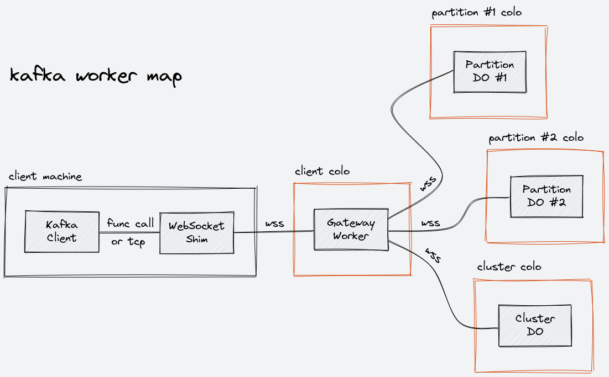

# Kafka Worker

**Note:** This project is a work in progress, and this document describes the desired end state. Only a subset of this has been implemented so far.

A Kafka 0.8.0 broker implementation on top of Cloudflare Workers and Durable Objects. This broker supports 4 client-facing APIs:

1. [Produce API](https://kafka.apache.org/protocol.html#The_Messages_Produce) (Version: 0)
2. [Fetch API](https://kafka.apache.org/protocol.html#The_Messages_Fetch) (Version: 0)
3. [ListOffsets API](https://kafka.apache.org/protocol.html#The_Messages_ListOffsets) (Version: 0)
4. [Metadata API](https://kafka.apache.org/protocol.html#The_Messages_Metadata) (Version: 0)

No other APIs (such as administrative APIs) or API versions are supported.

## WebSocket Shim

The Kafka protocol uses TCP. Cloudflare Workers does not support plain TCP connections (at least until [Socket Workers](https://blog.cloudflare.com/introducing-socket-workers/) is available), but it does support WebSocket connections. To make this work, we need to frame Kafka protocol messages sent over TCP into WebSocket messages. The [`kafka-websocket-shim`](https://github.com/maxwellpeterson/kafka-websocket-shim) project implements this functionality, and must be used to connect to this broker.

## Design

If you are unfamiliar with Kafka's design philosophy, I would recommend reading [this article by Jay Kreps](https://engineering.linkedin.com/distributed-systems/log-what-every-software-engineer-should-know-about-real-time-datas-unifying) first.

Kafka 0.8.0 dates all the way back to 2013, which was a much simpler era. There are only 2 types of state that we need to keep track of: records stored in partitions, and information about which topics and partitions exist. In this design, a Durable Object is created for each partition, and a single Durable Object is created for topic and partition information (this is referred to as the "global cluster DO"). Just like normal Kafka, writes to separate partitions are independent operations, and records within each partition are guaranteed to be read in the same order they were written.

Each client connection is handled by a "gateway worker" that runs in the Cloudflare data center (also referred to as "colo") closest to the client's location. The gateway worker handles requests from the client, and makes internal subrequests to partition DOs and the global cluster DO as needed. Each DO contacted by the gateway worker may be located in the same data center as the gateway worker instance (the ideal case), or may be located somewhere else.

### What about replication? What about leadership election?

There is none, at least not in the application code. The point of using Durable Objects here is that we can offload these complexities onto the infrastructure layer, and keep our application code focused and minimal. As described in the [initial blog post](https://blog.cloudflare.com/introducing-workers-durable-objects/), this is the serverless philosophy applied to persistent state. Replication and strong consistency mechanisms are implemented internally, and all we need to do is use the Durable Object API to reap these benefits. Building a Kafka broker without implementing replication and leadership election feels like cheating, but also makes this a much more tractable project.

In this design, each deployment has one logical broker than spans Cloudflare's entire network. The hostname and port of this broker is the hostname and port of the gateway worker. Translated to the traditional Kafka model, this broker is the leader node for all partitions, and all partitions have zero replica nodes and zero ISR nodes.

## Map

