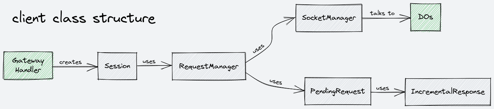

# Client

This folder contains files related to the gateway worker, which manages client connections. Each file contains one class, with the exception of `pending-request.ts`, which contains an interface and set of API-specific implementations. The general structure of these classes is described by the diagram below, and more detailed descriptions are included in the comments of each file.

## Class Structure

## Map

