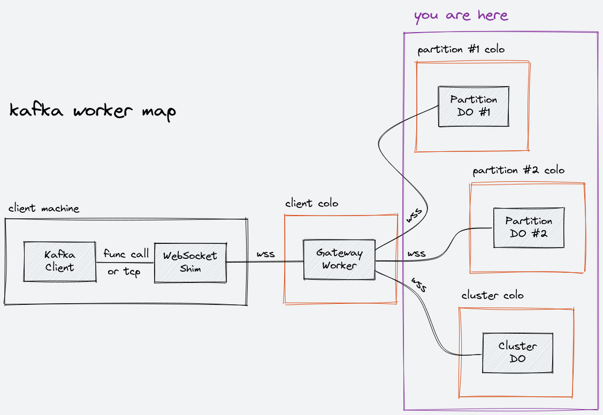

# State

This folder contains files related to Durable Objects. This project uses two Durable Object classes, which are defined in `cluster.ts` and `partition.ts`. Partition data is split into a continuous sequence of fixed-size chunks, whose format is defined in `chunk.ts`.

## Map

